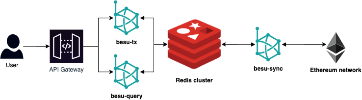

# Besu Redis

> Key value store plugin

## Abstract 
You can find the built plugin in [/build](/build)

## Overview

Using a Redis cluster as a storage engine for Besu enables to specify multiple types of Besu nodes depending on the features. This approach would allow us to have optimized nodes for query the database. RocksDB's lock mechanism makes harder to have multiple instances of Besu accessing the same database. Redis on the other hand enables this use case, we can imagine a categorisation of Besu nodes like the following:

- **besu-tx**: Handling of local transaction pool.
- **besu-sync**: Handling of blockchain synchronisation through Ethereum P2P network. 
- **besu-query**: Handling of database queries.

## Architecture



## Besu Node with the Redis storage plugin.
```shell script
 --key-value-storage=redis-storage --plugin-redis-storage-host=localhost --plugin-redis-storage-port=6379
```


## Building (Optional)
### Usage

> Besu 1.5.0 [bintray download]( https://bintray.com/hyperledger-org/besu-repo/download_file?file_path=besu-1.5.0.tar.gz)

#### Start Redis server.
Using docker compose:
```shell script
docker-compose -f ./docker/redis.yml up -d
```
Redis + Web UI
```shell script

docker-compose -f ./docker/redis.yml -f ./docker/redis-ui.yml up -d
```
Go to http://127.0.0.1:8081

Remove Redis volume:
```shell script
docker-compose -f ./docker/redis.yml -f ./docker/redis-ui.yml down 
or
docker volume rm -f docker_redis_data
```
#### Build Redis plugin
```shell script
./gradlew assemble
```
#### Start Besu with the Redis storage plugin.
```shell script
 --key-value-storage=redis-storage --plugin-redis-storage-host=localhost --plugin-redis-storage-port=6379
```
